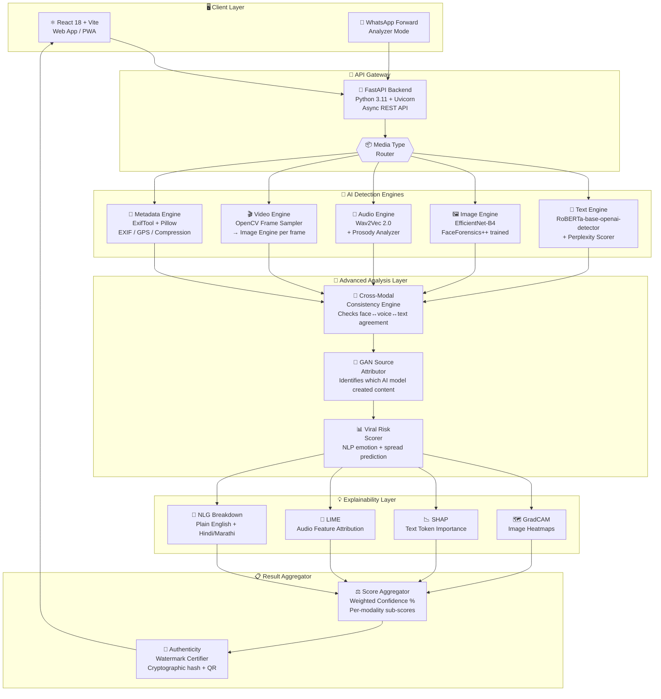
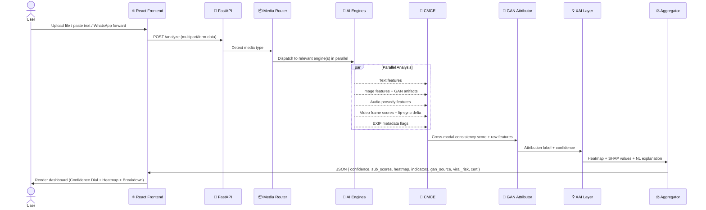
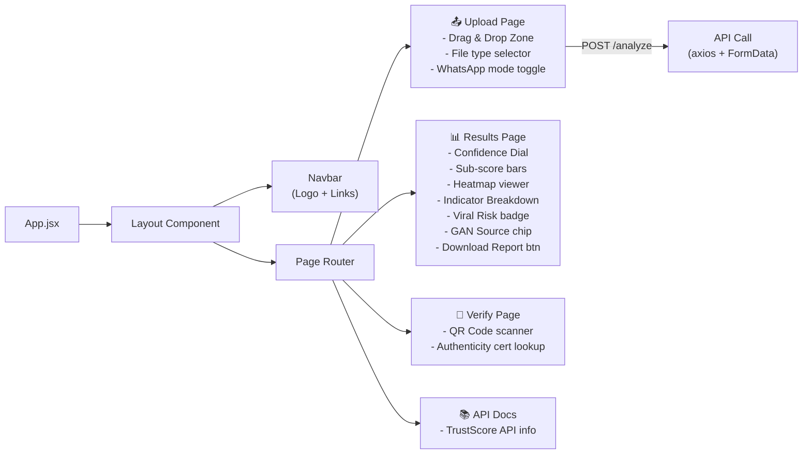
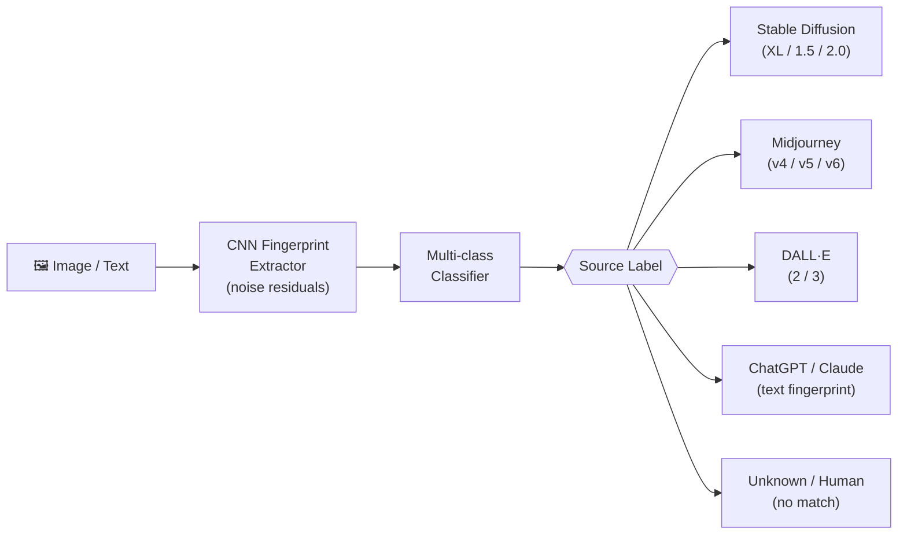
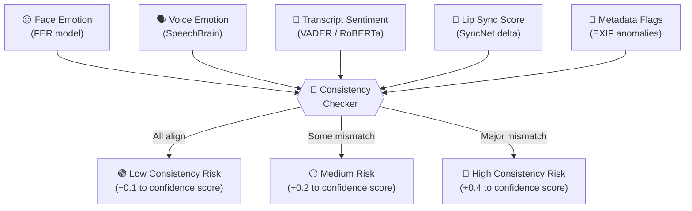
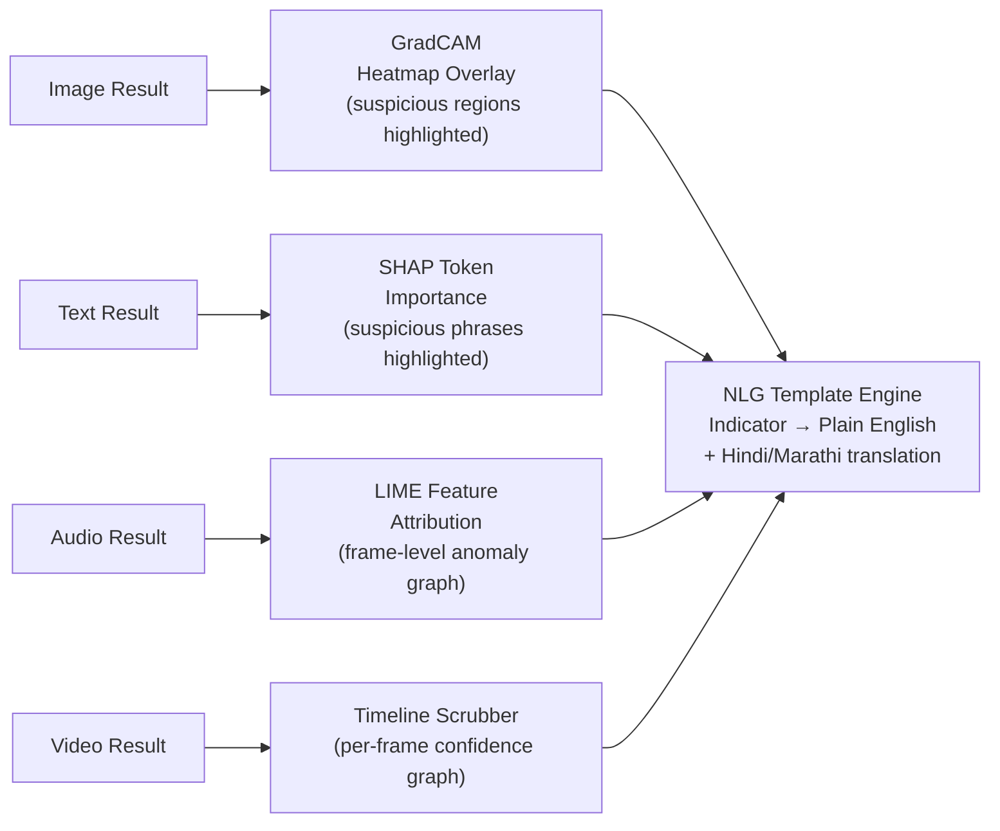
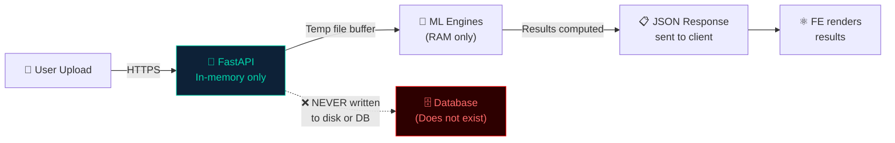
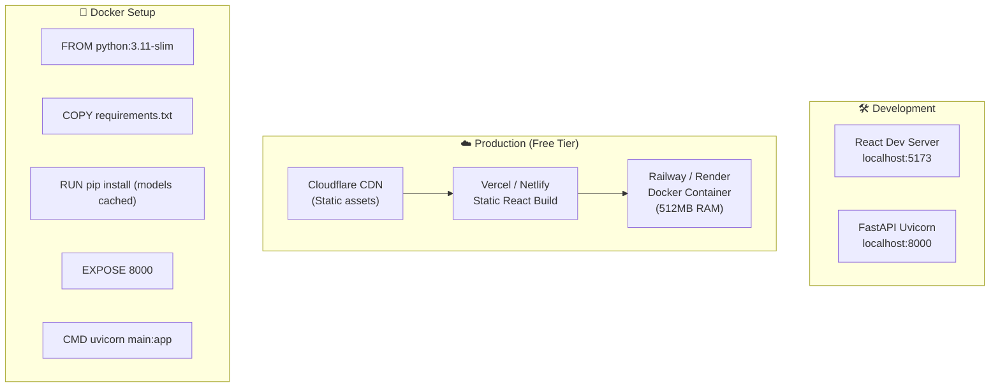

# 🏗️ VeraVision — Technical Architecture
### HackHive 2.0 | Cybersecurity Domain | PS3: AI-Generated Content & Deepfake Detection

---

## 🔷 System Overview

**VeraVision** is a multi-modal AI deepfake detection platform built on a modular, stateless, privacy-first architecture. Every media input is analyzed through dedicated AI engines, cross-verified via the **Cross-Modal Consistency Engine (CMCE)**, attributed to a likely AI source via **GAN Fingerprinting**, explained via an **XAI layer**, and finally scored for **viral misinformation risk** — all without retaining any user data.

---

## 1. High-Level Architecture



---

## 2. Request Lifecycle (Sequence Diagram)



---

## 3. Component Breakdown

### 3.1 Frontend (React 18 + Vite)



### 3.2 Backend (FastAPI)

```
POST /analyze          → Main analysis endpoint
POST /watermark        → Generate authenticity certificate
GET  /verify/{hash}    → Verify a watermarked content hash
GET  /health           → Health check
GET  /docs             → Swagger UI (auto-generated)
```

### 3.3 AI Engine Specifications

| Engine | Model | Dataset | Accuracy |
|---|---|---|---|
| **Text** | `roberta-base-openai-detector` (HuggingFace) | OpenWebText + GPT outputs | ~88% F1 |
| **Image** | EfficientNet-B4 fine-tuned | FaceForensics++ (1M+ manipulated frames) | ~91% AUC |
| **Audio** | Wav2Vec 2.0 + custom prosody head | ASVspoof 2019 dataset | ~85% EER |
| **Video** | Frame sampling → Image engine | FaceForensics++ video subset | ~89% AUC |
| **Metadata** | Rule-based EXIF analyzer | No ML — deterministic rules | ~100% rule accuracy |

### 3.4 GAN Source Attributor



### 3.5 Cross-Modal Consistency Engine (CMCE)



### 3.6 Explainability & Indicator Breakdown



---

## 4. Data Flow & Privacy Architecture



**Privacy Guarantees:**
- ✅ Zero persistent storage — all analysis is in-memory
- ✅ No user accounts or login required
- ✅ Files are deleted from buffer immediately after response
- ✅ No analytics collected on content
- ✅ Fully self-hostable (Docker)

---

## 5. Deployment Architecture



---

## 6. Tech Stack Summary

| Layer | Technology | Version | Purpose |
|---|---|---|---|
| **Frontend** | React | 18.x | UI framework |
| **Build Tool** | Vite | 5.x | Fast dev + build |
| **Styling** | TailwindCSS | 3.x | Utility-first CSS |
| **Animation** | Framer Motion | 11.x | Confidence dial, transitions |
| **Charts** | Chart.js + react-chartjs-2 | 4.x | Sub-score bars, timeline |
| **Backend** | FastAPI | 0.110+ | Async REST API |
| **Server** | Uvicorn | 0.27+ | ASGI server |
| **ML Framework** | PyTorch | 2.2+ | Model inference |
| **NLP** | HuggingFace Transformers | 4.38+ | RoBERTa, Wav2Vec |
| **Computer Vision** | OpenCV | 4.9+ | Video frame sampling |
| **Image Processing** | Pillow | 10.x | Image handling + EXIF |
| **XAI - Image** | pytorch-grad-cam | 1.5+ | GradCAM heatmaps |
| **XAI - Text** | SHAP | 0.45+ | Token importance |
| **Metadata** | ExifRead / Pillow | - | EXIF forensics |
| **PDF Reports** | FPDF2 | 2.7+ | Downloadable report |
| **Translation** | googletrans | 4.0 | Hindi/Marathi mode |
| **Containerization** | Docker | 24.x | Reproducible deploy |

---

## 7. API Specification

### `POST /analyze`

**Request:**
```json
{
  "file": "<multipart binary>",
  "media_type": "image | video | audio | text",
  "mode": "standard | whatsapp | watermark-verify",
  "language": "en | hi | mr"
}
```

**Response:**
```json
{
  "confidence_score": 0.78,
  "verdict": "Likely AI-Generated",
  "sub_scores": {
    "text": 0.82,
    "image": 0.74,
    "audio": 0.71,
    "video": 0.68,
    "metadata": 0.90
  },
  "cmce_risk": "HIGH",
  "gan_source": "Stable Diffusion XL",
  "gan_confidence": 0.71,
  "viral_risk_score": 0.65,
  "viral_risk_label": "High Spread Potential",
  "indicators": [
    "Unnatural eye blinking cadence detected",
    "GAN fingerprint artifacts found in background pixels",
    "No EXIF camera metadata present — typical of AI-generated images",
    "Emotional tone mismatch between face and voice detected"
  ],
  "indicators_hi": [
    "आँखों की असामान्य पलक झपकाने की लय पाई गई",
    "पृष्ठभूमि पिक्सल में GAN फिंगरप्रिंट आर्टिफेक्ट मिले"
  ],
  "heatmap_url": "/results/heatmap_abc123.png",
  "timeline": [
    { "timestamp": "00:04", "score": 0.91 },
    { "timestamp": "00:07", "score": 0.87 }
  ],
  "processing_time_ms": 2340
}
```

---

## 8. Folder Structure

```
veravision/
├── frontend/
│   ├── src/
│   │   ├── components/
│   │   │   ├── ConfidenceDial.jsx      ← Animated gauge
│   │   │   ├── HeatmapViewer.jsx       ← GradCAM overlay
│   │   │   ├── IndicatorBreakdown.jsx  ← Plain English panel
│   │   │   ├── TimelineScrubber.jsx    ← Video timeline
│   │   │   ├── UploadZone.jsx          ← Drag & drop
│   │   │   └── VernacularToggle.jsx    ← Hindi/Marathi switch
│   │   ├── pages/
│   │   │   ├── Analyze.jsx
│   │   │   ├── Results.jsx
│   │   │   └── Verify.jsx
│   │   └── App.jsx
│   └── package.json
│
├── backend/
│   ├── main.py                     ← FastAPI app entry
│   ├── routers/
│   │   ├── analyze.py              ← /analyze endpoint
│   │   ├── watermark.py            ← /watermark endpoint
│   │   └── verify.py               ← /verify endpoint
│   ├── engines/
│   │   ├── text_engine.py          ← RoBERTa inference
│   │   ├── image_engine.py         ← EfficientNet inference
│   │   ├── audio_engine.py         ← Wav2Vec inference
│   │   ├── video_engine.py         ← OpenCV + frame engine
│   │   └── metadata_engine.py      ← EXIF forensics
│   ├── modules/
│   │   ├── cmce.py                 ← Cross-Modal Consistency Engine
│   │   ├── gan_attributor.py       ← GAN source attribution
│   │   ├── viral_scorer.py         ← Viral risk scoring
│   │   ├── xai/
│   │   │   ├── gradcam.py          ← Image heatmaps
│   │   │   ├── shap_text.py        ← Text SHAP
│   │   │   └── lime_audio.py       ← Audio LIME
│   │   └── vernacular.py           ← Hindi/Marathi translation
│   ├── utils/
│   │   ├── report_generator.py     ← PDF report
│   │   └── watermark_crypto.py     ← Authenticity cert
│   └── requirements.txt
│
└── Dockerfile
```
